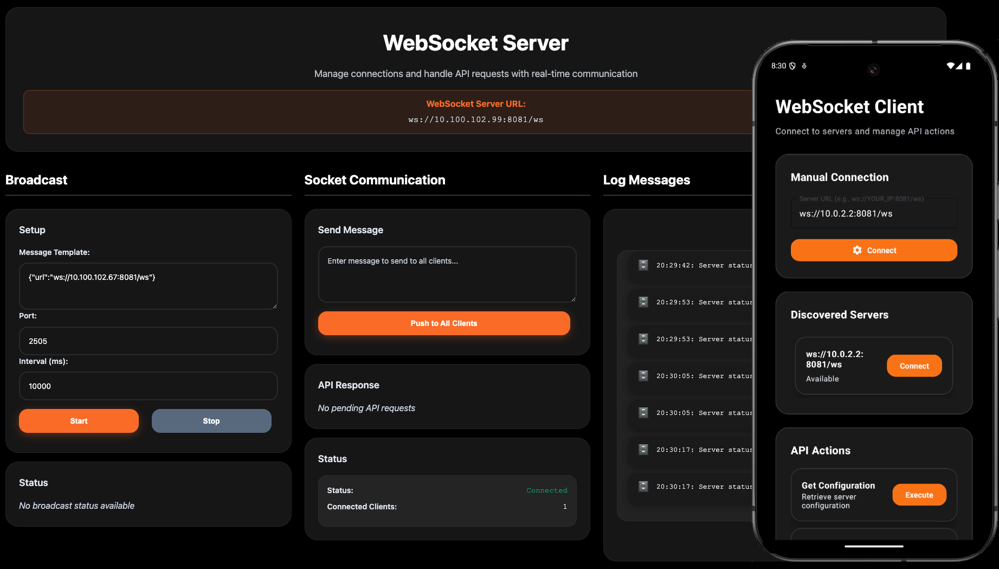

# WebSocket Mock Server



A simple Kotlin WebSocket server built with Ktor that provides a mock WebSocket endpoint for testing and development, with an Android example client.

## Features

- WebSocket endpoint at `/ws`
- Static file serving
- Echo functionality for WebSocket messages
- Automatic browser opening
- **Android example app** demonstrating WebSocket client usage
- **Automatic server discovery** via UDP broadcast
- **Network-agnostic design** - no hardcoded IP addresses

## Prerequisites

### Server
- Java JDK 11 or higher (Gradle wrapper downloads the rest)
- Bash-compatible shell (macOS/Linux) or PowerShell (Windows)

### Android Example (optional)
- Android Studio Hedgehog or newer
- Android SDK 34+
- USB-debuggable device or emulator

> ℹ️ Windows users should run `make` from PowerShell (`pwsh` or Windows Terminal) so the platform-specific script can launch.

## Quick Start

### 1. Start the WebSocket Server

#### Recommended: cross-platform `make` targets

```bash
make start
make stop
make restart
```

> **What these commands do:**
- `make start` → on macOS/Linux runs `start-server.sh`; on Windows runs `start-server.ps1`. Both free port 8081, start the server, and open your browser.
- `make stop` → invokes the matching platform routine to stop the Gradle process.
- `make restart` → stops first, waits 2 seconds, then starts again.

#### Alternatives
- macOS/Linux script: `./start-server.sh`
- Windows PowerShell: `.\start-server.ps1`
- Direct Gradle (no browser auto-open): `./gradlew :server:run`

### 2. Run the Android Example App

#### Option 1: Using Android Studio (Recommended)
1. Open the project in Android Studio
2. Wait for the project to sync and build
3. Select the `:examples:android` module in the run configuration dropdown
4. Choose your target device (emulator or physical device)
5. Click the "Run" button (green play icon) or press `Shift+F10`
6. The app will build and install on your device
7. The app will automatically discover and connect to the server

#### Option 2: Using Command Line
```bash
# Build and install the Android app
./gradlew :examples:android:installDebug

# Or run directly (requires connected device/emulator)
./gradlew :examples:android:run
```

#### Connection Configuration
- **Automatic Discovery**: The app automatically discovers servers on the network via UDP broadcast
- **Manual Connection**: You can manually enter any WebSocket server URL
- **Emulator Support**: Automatically detects emulator environments and prefills the connection URL
- **Network Agnostic**: Works with any network configuration without hardcoded IPs

## Usage

### WebSocket Connection
Connect to the WebSocket endpoint at:
```
ws://localhost:8081/ws
```

### Testing WebSocket
1. Open the browser to `http://localhost:8081`
2. Use browser developer tools or a WebSocket client
3. Send messages to the WebSocket endpoint
4. The server will echo back: "Echo: [your message]"

## Android Client

The Android companion app auto-discovers servers on your network, supports manual connections, and offers a modern Material Design 3 UI for interactive testing.

```bash
# Install debug build on a connected device/emulator
./gradlew :examples:android:installDebug

# Optional: run straight from Gradle
./gradlew :examples:android:run
```

- Automatic UDP discovery locates servers and reports their status.
- Emulator detection pre-fills the loopback URL (`ws://10.0.2.2:8081/ws`).
- Manual mode lets you target any WebSocket endpoint.

## Project Structure

```
websocket-mock-server/
├── server/                    # WebSocket server module
│   ├── src/main/kotlin/com/websocketmockserver/
│   │   └── Application.kt     # Main server application
│   └── src/main/resources/
│       ├── static/            # Static files
│       └── application.conf   # Configuration
├── examples/
│   └── android/              # Android example app
│       ├── src/main/java/com/example/websocketclient/
│       │   ├── MainActivity.kt
│       │   ├── MainViewModel.kt
│       │   ├── MessagesAdapter.kt
│       │   ├── ServerDiscovery.kt
│       │   └── WebSocketMessage.kt
│       └── src/main/res/     # Android resources
├── build.gradle.kts          # Root build configuration
├── Makefile                  # Convenient commands (make start/stop)
├── start-server.sh           # Auto-start script (macOS/Linux)
├── start-server.ps1          # Auto-start script (Windows PowerShell)
└── README.md                 # This file
```

## Stopping the Server

- `make stop` (cross-platform)
- Press `Ctrl+C` in the terminal that launched the server
- If the port is wedged: `lsof -ti:8081 | xargs kill -9` (macOS/Linux)

## Development

### Quick Commands
```bash
# Build the project
make build

# Clean build artifacts
make clean

# Show all available commands
make help
```

### Building with Gradle
```bash
# Build everything
./gradlew build

# Build server only
./gradlew :server:build

# Build Android app only
./gradlew :examples:android:build
```

## Configuration

The server runs on port 8081 by default. You can change this in `server/src/main/kotlin/com/websocketmockserver/Application.kt`:

```kotlin
embeddedServer(Netty, port = 8081, host = "0.0.0.0") {
    // ...
}
```

## Dependencies

### Server
- **Ktor Server Core**: Web framework
- **Ktor Server Netty**: Netty engine
- **Ktor WebSockets**: WebSocket support
- **Ktor HTML Builder**: HTML templating
- **Logback**: Logging framework

### Android Example
- **OkHttp**: WebSocket client
- **AndroidX**: Modern Android components
- **Material Design**: UI components 